Architecture layers
===================

Frontend
--------

The **frontend** of the application is developed using **Vue.js**, a
modern JavaScript framework for building user interfaces.\
It provides a responsive and dynamic experience, allowing users to
interact seamlessly with the platform through an intuitive and efficient
web interface.

Backend
-------

The **backend** of the application is built with **Spring Boot**,
leveraging **Spring WebFlux** to handle asynchronous and non-blocking
operations.\
This architecture ensures high performance and scalability, allowing the
system to efficiently manage multiple requests and real-time data
processing across the platform.

Database
--------

The application uses **PostgreSQL** as its **database**, a powerful
open-source relational database system known for its reliability,
scalability, and advanced support for complex queries and data
integrity.

Blockchain
----------

For the **blockchain layer**, the application leverages the **Polygon**
network, ensuring fast and low-cost transactions.\
The **smart contracts** are developed in **Solidity**, enabling secure
and transparent management of data and interactions on the blockchain.

System Component Interactions
-----------------------------

The interactions between the system components are as follows:

-   The **frontend** (built with Vue.js) sends requests to the
    **backend** through secure APIs.

-   The **backend** (developed with Spring Boot and WebFlux) processes
    the business logic, stores data in the **PostgreSQL** database, and
    schedules blockchain transactions.

-   The **blockchain transactions** are executed asynchronously through
    a **queued job system** within the backend, ensuring reliable and
    consistent interaction with the **Polygon** network

Blockchain Architecture Overview
================================

Managed Wallet Module (ERC-4337 Account Abstraction)
----------------------------------------------------

The **Bledger** platform implements a managed wallet module based on the
**ERC-4337** account-abstraction standard. This module enables an
advanced, secure approach to wallet management with a strong focus on
scalability and security---without requiring end users to self-custody
their wallets.

### Architecture

-   **Smart-contract wallets via Safe (ex Gnosis Safe):**\
    Bledger uses open-source **Safe** contracts---the leading on-chain
    wallet management standard---to instantiate a **multisignature
    smart-contract wallet** for each user.

-   **Per-user wallet address:**\
    At registration, the platform deterministically computes a unique
    wallet address for each user.

-   **Admin wallet delegation:**\
    Each wallet is initialized to **delegate an Admin wallet**.

    -   The Admin wallet's private key **can be managed via AWS KMS**.

    -   **PoC note:** KMS is not included in the PoC; initially, the key
        will be stored in a configuration file.

### Operational Benefits

-   **Platform-executed transactions:**\
    Although every user has a distinct address, the platform can
    autonomously execute transactions **without managing an unbounded
    number of private keys**.

-   **Centralized gas funding:**\
    A single administrative key also enables management of a
    **centralized cryptocurrency treasury** to pay blockchain
    transaction fees.

-   **Flexible signer management:**\
    This custody model supports **adding or removing authorized private
    keys** on a wallet.

    -   In a future phase (not planned for the PoC), users and/or
        partners could interact directly on-chain with **their own
        wallets** instead of delegating custody to Bledger.

### Deployment Model

-   **Off-chain address calculation:**\
    Wallet addresses can be computed off-chain.

-   **On-chain instantiation:**\
    Actually deploying (instantiating) the smart-contract wallet
    **requires an on-chain transaction**.

    -   Deployment is handled **asynchronously** via a **scheduled job**

Network Token (ERC721 NFT)
--------------------------

In BLedger, each Business Network is represented by an **ERC-721 NFT
(Smart contract name BLedgerNetwork)**. The token anchor's identity and
permissions, while the evolving network state---the tree of companies
and documents---lives off-chain as JSON.

The network is organized as a hierarchical tree of companies (parents
and children), and its topology can be verified via the Merkle tree root
hash stored in the metadata. Each token stores a tokenURI pointing to a
metadata.json and an on-chain contentHash to ensure integrity.

For the PoC, the metadata.json could be retrieved from an internal
endpoint; in the future, storage on IPFS can be integrated.

### Roles & Authority

-   **Admin**: Full authority. Can mint networks, gate transfers, manage
    auditors, and update metadata.

-   **Company (Owner)**: Recipient of the network token; can update
    metadata and manage auditors for that specific network.

-   **Auditor**: per network--authorized wallets to update metadata
    after verifying network members' documents.

### Event Model (auditability)

The contract emits a concise set of events that serve as the
**authoritative audit log**. Indexing these events yields a complete
history for each network token:

-   **NetworkCreated(tokenId, to, uri, contentHash)** --- a network is
    instantiated and initialized.

-   **NetworkUpdated(tokenId, updater, newUri, contentHash, reason)**
    --- the metadata link/hash changes with a typed reason

    -   Generic: When Business Network administrator changes the tree
        structure

    -   Upload: When a member of the network uploads his scope files

    -   Audit: When an auditor verifies a network member's scope files

    -   RefusedInvitation: When an invited company refuses to enter the
        network

Reason can be observed on the blockchain explorer transaction logs

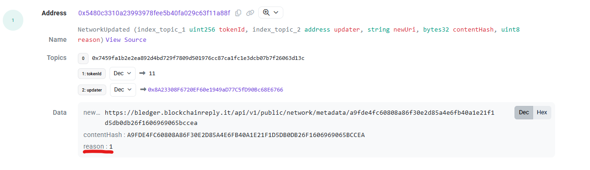{width="6.697916666666667in"
height="1.9375in"}\
Every reason has its key that are:

-   Generic: 0

-   Upload: 1

-   Audit: 2

-   RefusedInvitation: 3

-   **AuditorSet(tokenId, auditor, active)** --- an auditor is
    added/removed for that network.

**Why this matters**: These events make it straightforward to build
timelines (who changed what, when, and why) and to reconcile off‑chain
metadata snapshots with the on‑chain integrity anchor.

Example on blockchain explorer

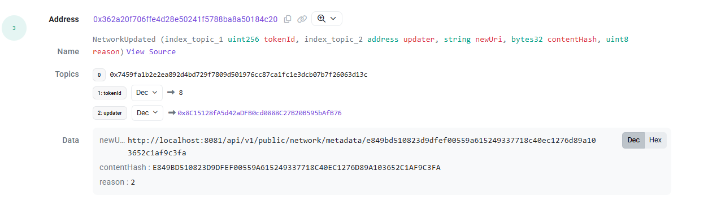{width="6.260416666666667in"
height="1.84375in"}

### Data Model --- Off‑Chain metadata.json

**NetworkMetadata**

-   **networkId** --- identifier of the network

-   **networkCreated, networkUpdated** --- business timestamps for the
    lifecycle of the network.

-   **metadataCreated** --- timestamp of this particular snapshot.

-   **merkleHash** --- integrity root over the network tree structure

-   **membersCount** --- number of companies/nodes in the tree.

-   **uploadedCount, auditedCount** --- document activity counters.

-   **docs** --- array of **DocumentMetadata** entries.

**DocumentMetadata**

-   id --- unique document identifier.

-   nodeId --- internal identifier of a company inside the network.

-   documentHash --- keccak256 document hash.

### Typical Flows

**Onboarding a Network**

-   **Admin** mints the token to the company wallet → **NetworkCreated**
    is emitted → indexers cache the initial **tokenURI**.

**Auditor Management**

-   **Owner** adds one or more auditors → an **AuditorSet** event is
    emitted for **each** auditor.

**Document Upload**

-   A **network member** uploads a document → the platform updates
    metadata with reason **Upload** → **NetworkUpdated** is emitted.

**Audit**

-   An **auditor** verifies the document → the platform updates metadata
    with reason **Audit** → **NetworkUpdated** is emitted.

How to verify on-chain data
===========================

### Reading contract

-   **Open the Network details**\
    On the *Network detail* page, click the **Polygon icon** next to the
    network name 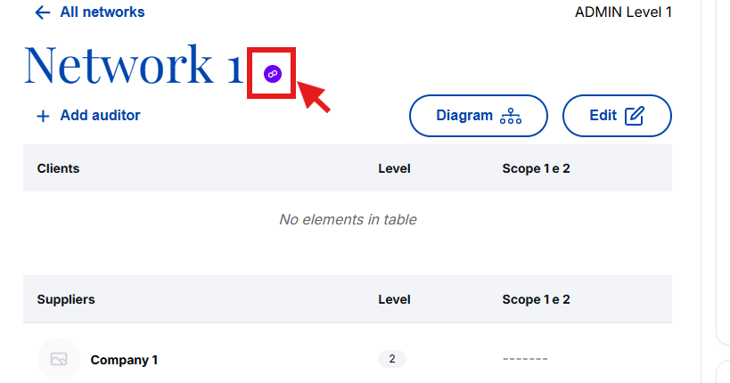{width="6.010416666666667in"
    height="3.1602187226596676in"}

-   **View network transactions**\
    A **modal** opens showing the list of network transactions. At the
    top, you'll see:

    -   the **on-chain token ID**

    -   the **"See in Explorer"** link\
        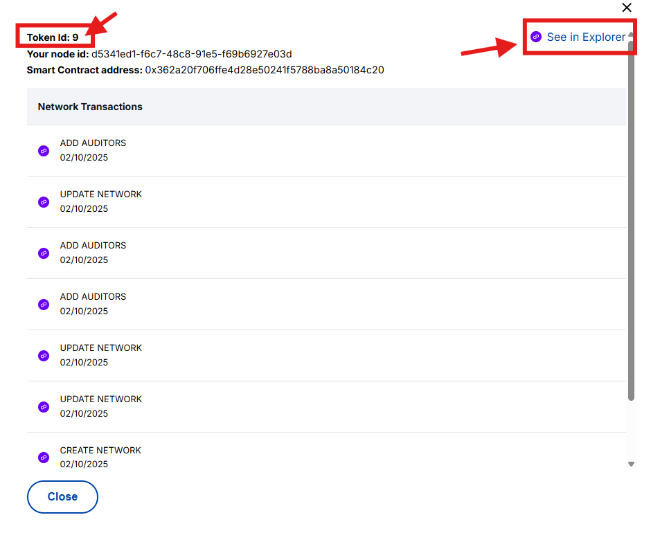{width="5.510416666666667in"
        height="4.529361329833771in"}

-   **Go to the explorer**\
    Click **"See in Explorer."** The **blockchain explorer** opens
    directly in the **Read Contract**
    section.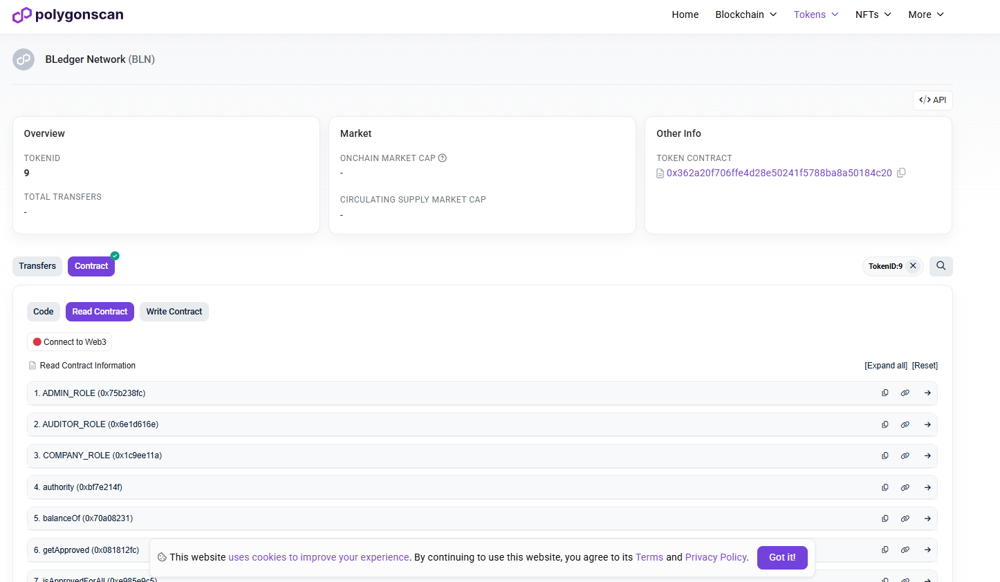{width="6.010416666666667in"
    height="3.500242782152231in"}

-   **Browse available functions**\
    In **Read Contract**, you'll find all readable functions of the
    contract

-   **Example: fetch the current metadata JSON**

    -   Open the **tokenURI** function.

    -   Enter the current **tokenId** in the input field *(see
        screenshot)*.

    -   Click **Query**.

    -   The call returns the URL to the **metadata.json** for that token
        *(see screenshot)*.

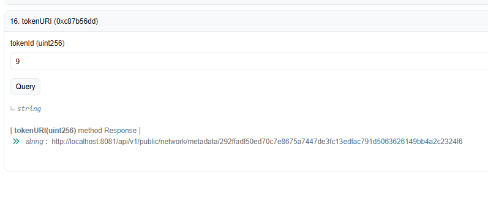{width="6.260416666666667in"
height="2.5625in"}

### Verifying integrity of the metadata.json

-   Copy the link returned from tokenUri function in a new browser tab

-   Copy the content in any Keccak256 hashing tool (for example:
    https://emn178.github.io/online-tools/keccak\_256.html),

-   The result should be the same as the final part of the link

    -   Example:
        *http://localhost:8081/api/v1/public/network/metadata/292ffadf50ed70c7e8675a7447de3fc13edfac791d5063626149bb4a2c2324f6*

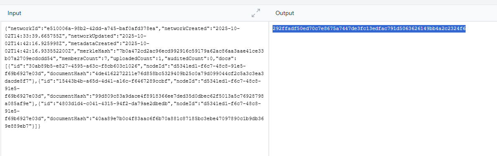{width="5.510416666666667in"
height="1.7395833333333333in"}

### Verifying integrity of uploaded documents

-   Copy your node id from your network transaction
    tab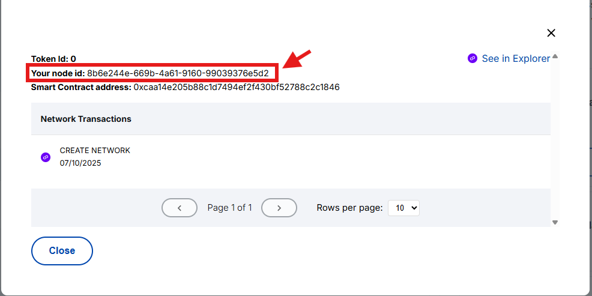{width="6.010416666666667in"
    height="3.0in"}

-   Search for it in the metadata json (you can use a json formatter for
    better visibility), you should find three records under docs with
    your node id (one for every uploaded file)\
    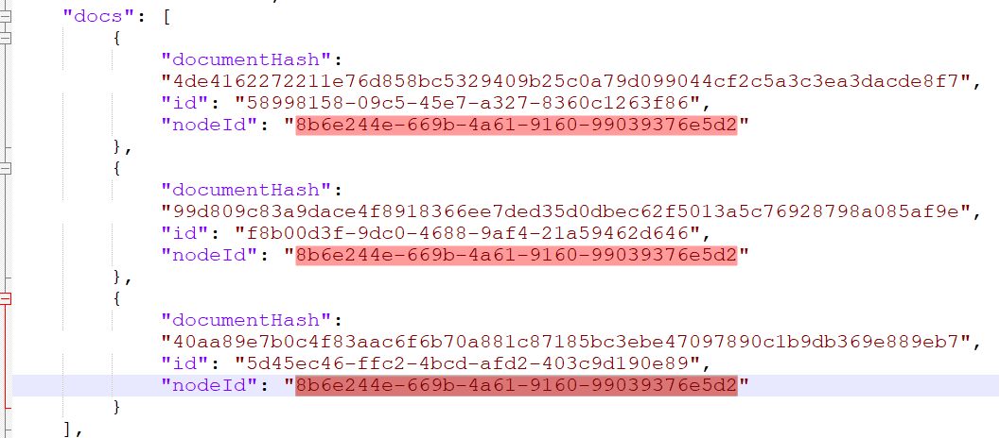{width="6.010416666666667in"
    height="2.6354166666666665in"}

-   Using a Keccak256 file hashing tool (ex.
    https://emn178.github.io/online-tools/keccak\_256\_checksum.html)
    you can upload the files you uploaded in the platform and verify
    that the hash is identical to one of your records in the
    metadata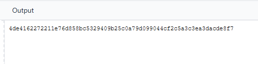{width="5.511185476815398in"
    height="1.3647736220472442in"}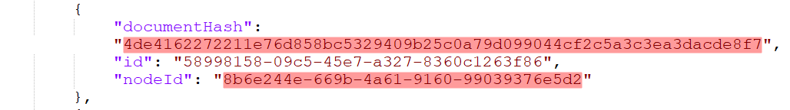{width="6.010416666666667in"
    height="0.84375in"}

### Verifying integrity of network tree structure (Only Business Network Admin)

**NB: Since only Business Network Admin has access to the entire tree
structure, he is the only one who can do this verification**

-   Open Network tree from "Organigram Button"\
    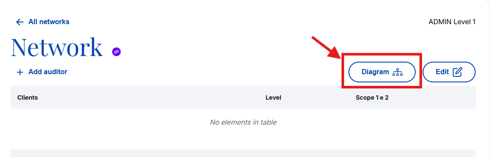{width="6.010416666666667in"
    height="1.9166666666666667in"}

-   Download the tree json from "JSON"
    button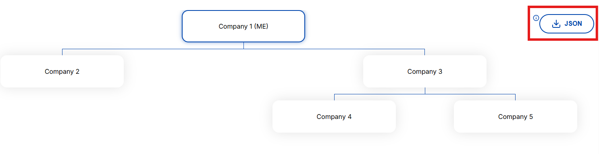{width="6.010416666666667in"
    height="1.5416666666666667in"}

-   Using the endpoint /public/network/merkle-hash, you can send a POST
    API request with the downloaded JSON as the body. The API returns
    the Merkle root hash, which should match the merkleHash field in the
    metadata.json.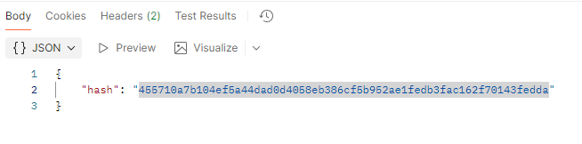{width="6.010416666666667in"
    height="1.4895833333333333in"}

> 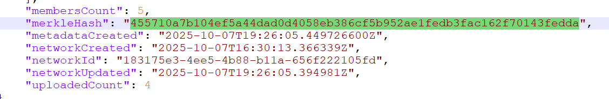{width="6.260416666666667in"
> height="1.0208333333333333in"}
